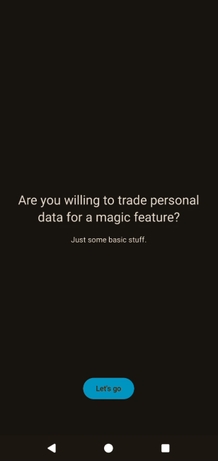
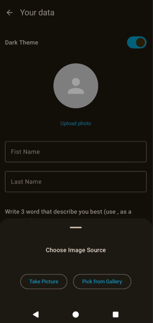
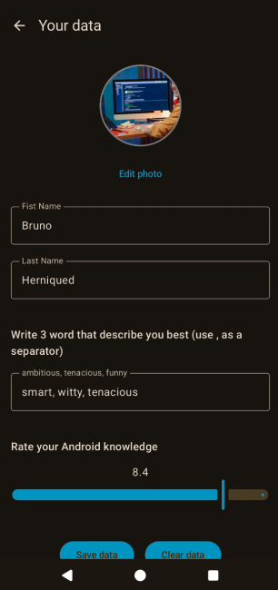
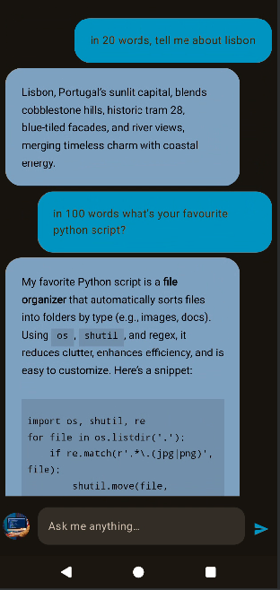
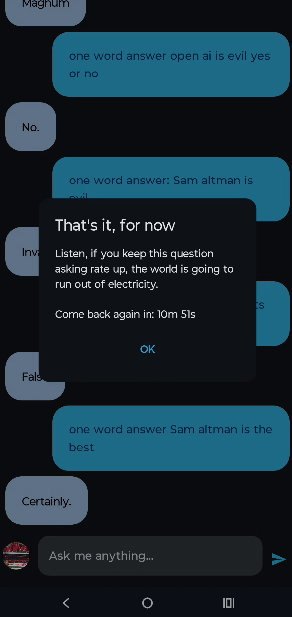

# SharedPreferences to DataStore

## Demo

  
  

## About 

This is a showcase application for the [Droidcon Lisbon 2025](https://www.lisbon.droidcon.com/)
session: "SharedPreferences Caterpillar to DataStore Butterfly: How to Migrate and Make Your App
Fly". The application simulates a "chatbot" that needs your personal data in order to work.

- `main` branch has bot SharedPreferences and DataStore implementations, with SharedPreferences one
  being active
- `develop_sp` branch has only SharedPreferences implementation, the starting point one would
  encounter when doing the migration to DataStore
- `develop_ds` branch has only the DataStore implementation, the end point of the migration

To simulate the migration:

1. checkout develop_sp branch, run the app - fill the fields and play around with it.
2. switch to develop_ds branch, run the app - the app should keep the state as it was, but this time
   utilizing DataStore instead of Shared preferences. Note: when you do this switch, all the data
   in SharedPreferences will be deleted

The presentation of the session can be accessed [here](https://tinyurl.com/243xvbyl)

## License

[Read More](LICENSE)

